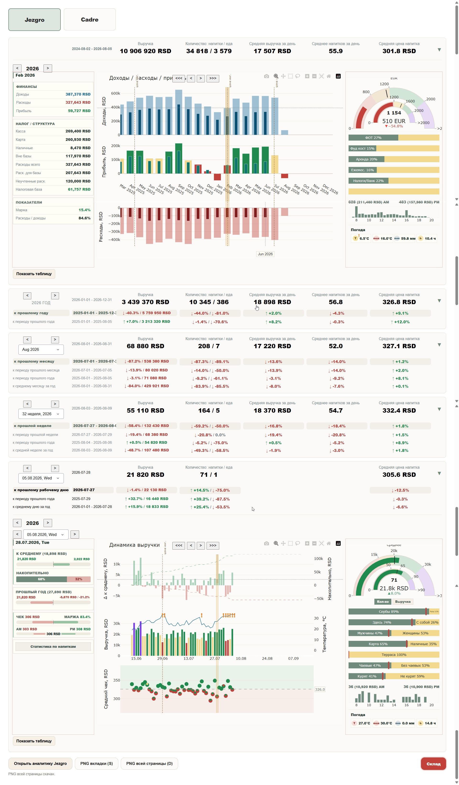

# Jezgro Analytics

A high-performance, Serbia-localized customer intelligence and operations platform for coffee shop management.

Jezgro Analytics is a working system that combines sales, customer behavior, recipes, prices, inventory, expenses, weather, and calendar context into one interactive analytical environment.

It is designed to support daily operational decisions: what customers buy, when they visit, how their preferences differ, which products generate margin, what stock needs replenishment, and which business processes should be adjusted.



---

## What the system does

Jezgro Analytics connects operational data from a coffee shop and turns it into fast, interactive analysis.

The platform covers:

- customer behavior and purchasing habits;
- sales, revenue, average check, and product mix;
- nationality, age groups, gender, and customer segments;
- payment preferences and service channel behavior;
- on-site versus takeaway operations;
- recipes, prices, costs, and margin;
- inventory, purchases, write-offs, and stocktakes;
- replenishment alerts and stock forecasts;
- operating expenses and profitability;
- weather, calendar events, seasonality, and demand patterns.

---

## Customer intelligence

The system builds a detailed picture of how customers interact with the business.

It analyzes:

- nationality distribution;
- age groups and gender mix;
- average check and spending patterns;
- preferred drinks, food, categories, and add-ons;
- payment behavior: cash versus card;
- on-site versus takeaway behavior;
- time-of-day and weekday demand;
- seasonal, weather-driven, and event-driven demand;
- differences between customer segments.

The purpose is not only reporting. These insights are used to adjust real business processes:

- menu and product-mix decisions;
- pricing and promotion strategy;
- stock and purchasing plans;
- preparation volumes;
- staffing and workload planning;


---

## Sales and performance analytics

- Revenue, quantity, average check, and average product price.
- Daily, weekly, monthly, and yearly views.
- Period-over-period and year-over-year comparisons.
- Product, category, payment, and service-channel analysis.
- Sales dynamics and cumulative growth/decline.
- Demand patterns by time, weather, season, and calendar events.
- Interactive navigation through analytical periods.


---

## Margin and financial reporting

- Product cost calculated from active recipes and effective price periods.
- Margin analysis by product and category.
- Revenue, operating expenses, and profitability views.
- Taxable-base and expense reporting.
- Analysis of ingredient cost, recipe, and pricing impact.


---

## Inventory and procurement

The inventory module covers ingredients, packaging, and operating supplies.

- Purchases, write-offs, sales-driven consumption, and stocktakes.
- Theoretical balance and actual inventory balance.
- Absolute and percentage discrepancy calculation.
- Replenishment limits and low-stock alerts.
- Forecast of remaining stock days based on recent working-day consumption.
- Consumption rules for operational supplies outside recipes.
- Packaging and consumables linked to products and service channels.


---

## Data processing

Jezgro Analytics receives and validates data from multiple operational sources:

```text
Daily sales files
Recipes and price catalogs
Inventory files
Purchases and write-offs
Operating expenses
Weather data
Calendar events
        ↓
Validation and ETL loading
        ↓
SQLite operational database
        ↓
Analytical data layers
        ↓
Interactive dashboard and operational reports
